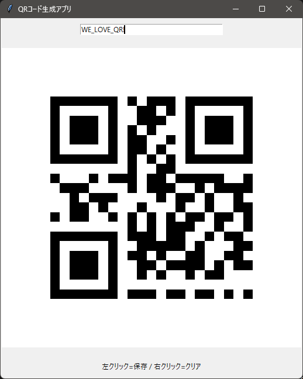

# QR Code Generator / QRコード生成アプリ

[English](#english) | [日本語](#japanese)

---

## English

### Description
A simple and intuitive QR code generator application built with Python and tkinter. This desktop application allows you to generate QR codes in real-time as you type and save them as PNG images.



### Features
- **Real-time QR code generation**: QR codes are generated instantly as you type
- **Easy saving**: Left-click on the QR code to save it as a PNG file
- **Quick clearing**: Right-click on the QR code to clear the input field
- **High resolution**: Generated QR codes are 512x512 pixels for clear readability
- **Simple interface**: Clean and user-friendly GUI

### Requirements
- Python 3.x
- tkinter (usually included with Python)
- PIL (Pillow)
- qrcode

### Installation

1. Clone this repository:
```bash
git clone https://github.com/Moge800/QR_Generator.git
cd QR_Generator
```

2. Install required dependencies:
```bash
pip install pillow qrcode
```

Note: The `requirements.txt.txt` file contains all dependencies including optional ones for building executables.

### Usage

1. Run the application:
```bash
python QR_Generator.py
```

2. Type any text in the input field - the QR code will be generated automatically

3. **Left-click** on the QR code image to save it as a PNG file

4. **Right-click** on the QR code image to clear the input field

### Building Executable
You can create a standalone executable using the included script:
```bash
python nuitka_exe_creater.py
```

### License
This project is licensed under the MIT License - see the [LICENSE](LICENSE) file for details.

---

## Japanese

### 概要
Pythonとtkinterで構築されたシンプルで直感的なQRコード生成アプリケーションです。このデスクトップアプリケーションでは、入力と同時にリアルタイムでQRコードを生成し、PNG画像として保存することができます。


### 機能
- **リアルタイムQRコード生成**: 入力と同時に瞬時にQRコードが生成されます
- **簡単保存**: QRコードを左クリックするとPNGファイルとして保存できます
- **クイッククリア**: QRコードを右クリックすると入力フィールドがクリアされます
- **高解像度**: 生成されるQRコードは512x512ピクセルで鮮明に読み取れます
- **シンプルなインターフェース**: 清潔で使いやすいGUI

### 必要環境
- Python 3.x
- tkinter（通常Pythonに含まれています）
- PIL (Pillow)
- qrcode

### インストール

1. このリポジトリをクローンします:
```bash
git clone https://github.com/Moge800/QR_Generator.git
cd QR_Generator
```

2. 必要な依存関係をインストールします:
```bash
pip install pillow qrcode
```

注意: `requirements.txt.txt`ファイルには実行ファイル作成用のオプション依存関係も含まれています。

### 使用方法

1. アプリケーションを実行します:
```bash
python QR_Generator.py
```

2. 入力フィールドに任意のテキストを入力すると、自動的にQRコードが生成されます

3. QRコード画像を**左クリック**するとPNGファイルとして保存できます

4. QRコード画像を**右クリック**すると入力フィールドがクリアされます

### 実行ファイルの作成
付属のスクリプトを使用してスタンドアロンの実行ファイルを作成できます:
```bash
python nuitka_exe_creater.py
```

### ライセンス
このプロジェクトはMITライセンスの下でライセンスされています。詳細は[LICENSE](LICENSE)ファイルをご覧ください。